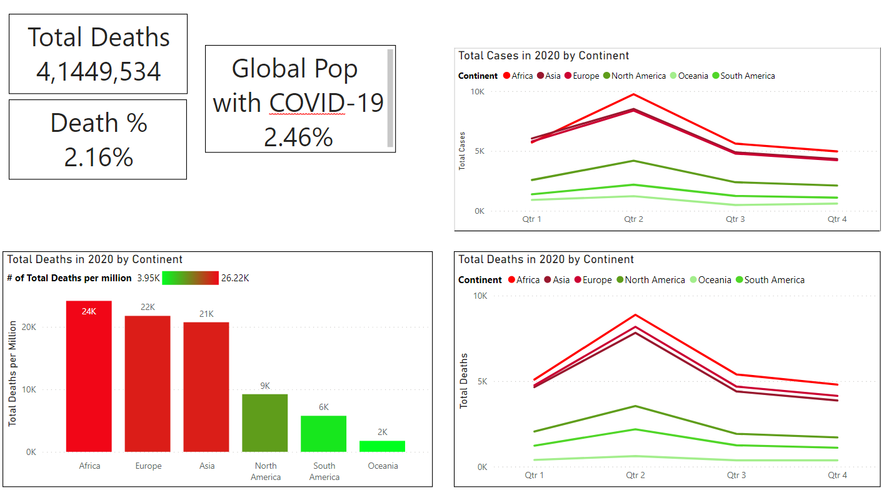

# MichaelR-Portfolio 
A look into the projects that I have completed as a data analyst

# Project 1 : [Nashville Data Cleaning](https://github.com/MichaelR98/NashvilleDataCleaning) 
## Goals SQL Queries
* Use CONVERT to standardize the date format.
* Use the JOIN and IS NULL functions to populate property address data that is NULL.
* Using SUBSTRING and break out Address into Individual Columns (Address, City, State) in order to make the data more usable for analysis.
* Using a CASE statement Clean the Sold As Vacant field by converting Y and N rows with YES and NO. 
* Using ROW NUMBER, PARTITION BY AND A CTE I remove duplicate rows.
* Finally I delete unused columns that would not be useful during analysis.

# Project 2 : [Hotel Dashboard](https://github.com/MichaelR98/Hotel-Project)
* Used a database on hotels that I found I wanted to look into PowerBi and see if it was more intuitive for me that Tableau

## Goals of the Dashboard
* Find out if the revenue of the hotels were growing by year. 
* Filter these trends by hotel type, countries and year.
* Provide a simple header that shows basic live info such as Total Revenue and ADR (average daily rate).
* Give the audience multiple different types of visualizations that explore different parts of the same data.
* Find out if more guests are bringing their own vehicles, creating a need for more parking spaces.

# Project 3 : [What Wins in the NFL?](https://github.com/MichaelR98/NFL-Powerpoint)
* Used R to create a correlation matrix to be used in a PowerPoint

## Goals of the PowerPoint
* Using 2020 stats I wanted to know which of the stats I choose has the highest corr with winning
* Create a ranked list
* Attempt to explain the results
* Look for interesting patterns
* Have fun

# The matrix I created in R 

# WIP Project 4 : [COVID-19 Exploration Project](https://github.com/MichaelR98/Covid-Portfolio-Project) 
## Using data found at [OurWorldInData.com](https://ourworldindata.org/covid-deaths)
### The Purpose of my SQL Queries
* Use a JOIN to combine the two large tables to explore global data on vaccinations and deaths.
* Explore the infection rate, total cases and total deaths grouped by countries or continents.
* Create a new column called RollingPeopleVaccinated that is an increasing sum that represents the total number of people vaccinated up to that day.
* In order to create this new column a CTE or Temp Table is needed.
* Finally I created a view in order to store the table for later visualizations.

# WIP Project 5 : [Bike-Service-Exploration](https://github.com/MichaelR98/Bike-Service-Exploration) 
## Dataset provided by the Google Data Analytics Program
### Project Goals
* Breakdown the current customer base for a bike sharing company by gender, usertype and age
* Using the fields provided try to figure out why the most common users use the service.
* Create a dashboard that shows: summary stats, a bar graph that displays the distributions.
* Add a line chart that shows the times at which people choose the service to see if the presumptions are true.

