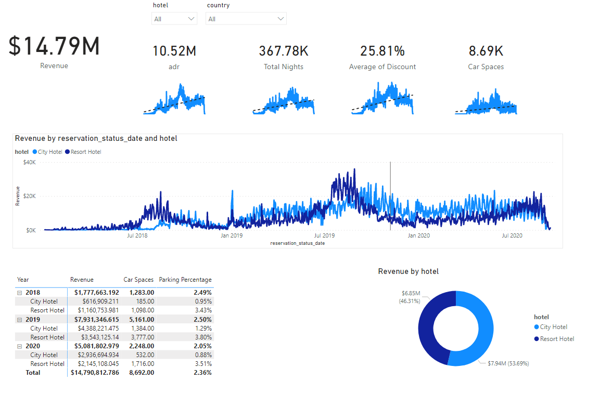

# MichaelR-Portfolio 
A look into the projects that I have completed as a data analyst

# Project 1 : [Destiny Armor Organizer](https://github.com/MichaelR98/Destiny2-Armor) 
## Goals Spreadsheet
* Create a way to sift through hundreds of armor pieces to save time.
* Use a SUM function to add togther similar stats to create a new matric to evaluate armor 
* Use Conditional Formatting to quickly assess the quality of armor in multiple categories.
* Use IF/AND/OR to categorize armor into various groups.
* Divide data into seperate tables based on class type. 

# Project 2 : [Nashville Data Cleaning](https://github.com/MichaelR98/NashvilleDataCleaning) 
## Goals of SQL Queries
* Used CONVERT to standardize the date format.
* Used the JOIN and IS NULL functions to populate property address data that is NULL.
* Using SUBSTRING and break out Address into Individual Columns (Address, City, State) in order to make the data more usable for analysis.
* Using a CASE statement Clean the Sold As Vacant field by converting Y and N rows with YES and NO. 
* Using ROW NUMBER, PARTITION BY AND A CTE I remove duplicate rows.
* Finally I delete unused columns that would not be useful during analysis.

# Project 3 : [Hotel Dashboard](https://github.com/MichaelR98/Hotel-Project)
* Used a database on hotels that I found I wanted to look into PowerBi and see if it was more intuitive for me that Tableau

## Goals of the Dashboard
* Find out if the revenue of the hotels were growing by year. 
* Filter these trends by hotel type, countries and year.
* Provide a simple header that shows basic live info such as Total Revenue and ADR (average daily rate).
* Give the audience multiple different types of visualizations that explore different parts of the same data.
* Find out if more guests are bringing their own vehicles, creating a need for more parking spaces.

# Project 4 : [What Wins in the NFL?](https://github.com/MichaelR98/NFL-Powerpoint)
* Used R to create a correlation matrix to be used in a PowerPoint

## Goals of the PowerPoint
* Using 2020 stats I wanted to know which of the stats I choose has the highest corr with winning
* Create a ranked list
* Attempt to explain the results
* Look for interesting patterns
* Have fun

# The matrix I created in R 

