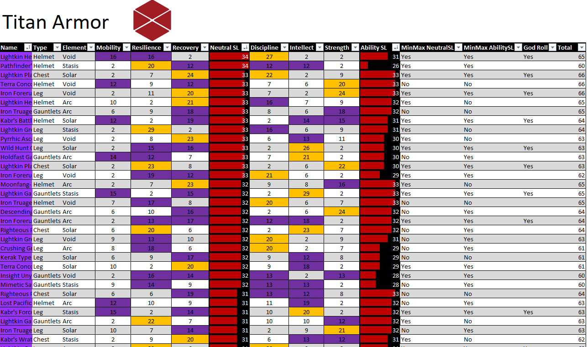

# MichaelR-Portfolio 
A look into the projects that I have completed as a data analyst
Titles have embeded hyperlinks to the projects

# Current Project : [How Home Field Effects Winning in the NFL](https://github.com/MichaelR98/Home-Field-Advantage) 
## Goals of Analysis
* Find what makes home field advatage effect winning in the NFL.
* Look at a few of the conditions that create a home field advatage and see how much each one effects winning.
* See if these effects are more salient amoung teams that win more games.
* My initial thought is that the better teams have more passionate fans who are more likely to create a strong home field advantage.

* Here's a small sample of the spreadsheet with secondary data that I found through many sources.
* A lot of the columns have been hidden to make it a bit more visually appealing.
* Sidenote: The FWI value is a measurement of the weather quality, a lower value means that conditions are less hostile.
* I am working on a Tableau Dashboard to show the results of the analysis.

# Project 1 : [Nashville Data Cleaning](https://github.com/MichaelR98/NashvilleDataCleaning) 
## Goals of SQL Queries
* Use CONVERT to standardize the date format.
* Use the JOIN and IS NULL functions to populate property address data that is NULL.
* Use SUBSTRING and break out Address into Individual Columns (Address, City, State) in order to make the data more usable for analysis.
* Use a CASE statement Clean the Sold As Vacant field by converting Y and N rows with YES and NO. 
* Use ROW NUMBER, PARTITION BY AND A CTE to remove duplicate rows.
* Finally I deleted unused columns that would not be useful during analysis.

# Project 2 : [Hotel Dashboard](https://github.com/MichaelR98/Hotel-Project)
* Used a database on hotels to make a dashboard for PowerBi practice

## Goals of the Dashboard
* Find out if the revenue of the hotels were growing by year. 
* Filter these trends by hotel type, countries and year.
* Provide a simple header that shows basic live info such as Total Revenue and ADR (average daily rate).
* Give the audience multiple different types of visualizations that explore different parts of the same data.
* Find out if more guests are bringing their own vehicles, creating a need for more parking spaces.

# Project 3 : [Python - Loan Data Project](https://github.com/MichaelR98/CRM-Python-Preprocessing-Project/blob/main/loan-data-preprocessed.csv)
# A capstone project from a Udemy Course using a sample dataset
* Used Python to preprocess a dataset about loans so that other could use the new csv file for analysis
* Used Numpy to clean data, fill missing values and convert strings into bools that could be used for analysis 
* Converted currencies and created new numeric categories to make analysis easier

# Project 4 : [Python - Movie Dataset Correlation](https://github.com/MichaelR98/Python-Regression-Project)
* Used Python to clean and analyze a dataset about movies. I was looking for which factors had the highest correlation with gross revenue.

# The matrix I created in Python and the code I used to make it.

corr_matrix = df.corr(method ='pearson',numeric_only=True)    
sns.heatmap(corr_matrix, annot=True)  
plt.title('Correlation Matrix of Movie Dataset')  
plt.show  

# Project 5 : [Destiny Armor Organizer](https://github.com/MichaelR98/Destiny2-Armor) 
## Goals of Spreadsheet
* Create a way to sift through hundreds of armor pieces to save time.
* Use a SUM function to add togther similar stats to create a new matric to evaluate armor 
* Use Conditional Formatting to quickly assess the quality of armor in multiple categories.
* Use IF/AND/OR to categorize armor into various groups.
* Divide data into seperate tables based on class type. 

# Project 6 (An older project I am currently updating using Python): [What Wins in the NFL?](https://github.com/MichaelR98/NFL-Powerpoint)
* Used R to create a correlation matrix to be used in a PowerPoint

## Goals of the PowerPoint
* Using 2020 stats I wanted to know which of the stats I choose has the highest corr with winning
* Create a ranked list
* Attempt to explain the results
* Look for interesting patterns

# The matrix I created in R 

